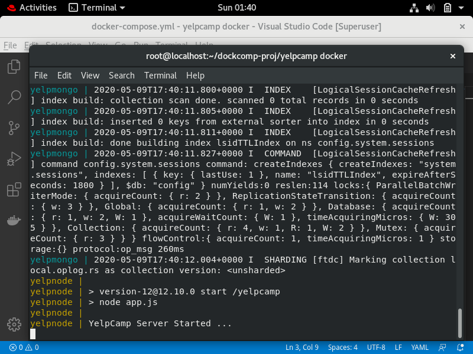
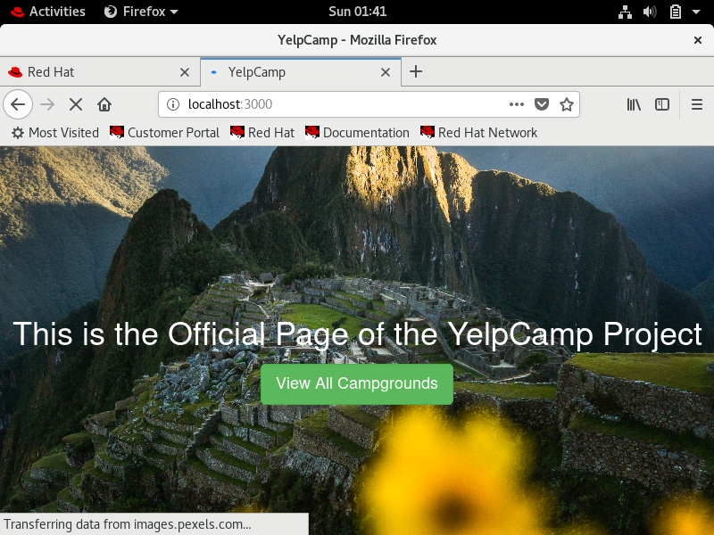
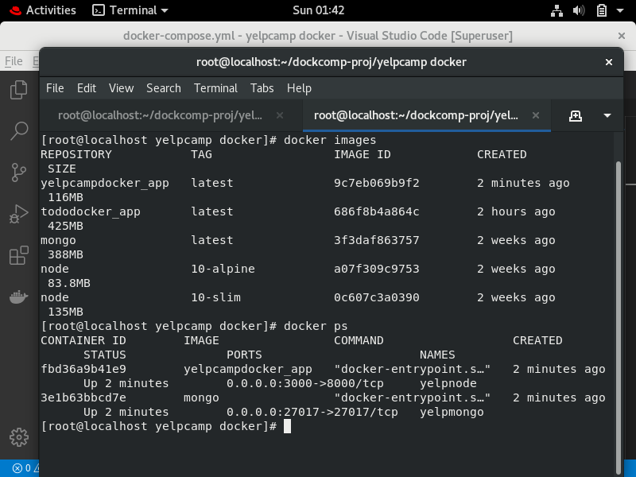
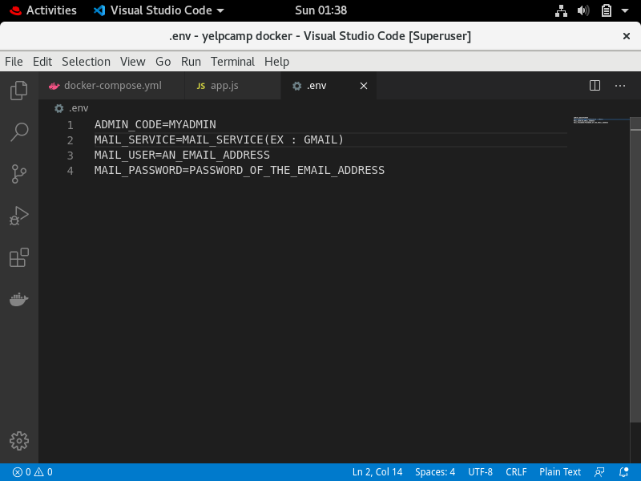

# YelpCamp with Docker

## App 2/2 created using Docker

I have created __two apps__ for submission.
The other one can be found in [this link](https://github.com/aditya-mitra/maker2do-docker)

### What I created?

When I was learning web development from a bootcamp, I was taught to create this application.
*(Well, that was just basic. This is a fully **refactored** one.)*

YelpCamp is a mega app, yet simple, created using NodeJS and Mongo running on a docker container.

Here a user can create, update, delete, comment on a campground, follow another user just by using this webapp.

*This web app can even be modified to twitter or airbnb like clone just by making some changes. :D*

## Quick Setup

*Assuming you have [docker](https://docs.docker.com/get-docker/) installed in your system, type this in the cloned repo:*

```
docker-compose up
```

**The container will start building up and will be ready in few moments**

You may see it like this:



**Head over to [localhost:3000](http://localhost:3000) to see use the app running inside docker container**



If you run `docker ps`, you will see two container _yelp node_ and _yelp mongo_ have fired up

**Also one image has also been created in the *docker images***

Run `docker images` to see it :




## Software used

**I used**

- My OS -> RHEL8
- Code Editor -> Visual Studio Code
- Docker
- NodeJS

#### Setup the .env file

Just change the *variables* in the **.env** file

(You can change the admin code to *your own secret code* so that only admins can login to perform admin options)

You may not need to use the mail services unless you *forget your account password*

However, you can use any mail service like *GMail* or *SendGrid* for this purpose.




# Acknowledgments


I want to thank [Mr Vimal Daga](https://www.linkedin.com/in/vimaldaga/) without whom this project would not have been complete
I learnt to use RHEL8 and Docker from his free sessions which conducted on youtube.


I also want to thank the most helpful team at [linux world](http://www.linuxworldindia.org/).
They were just amazing at their communication and for giving us enought time to complete this wonderful project!


**Once again, Thank you!**